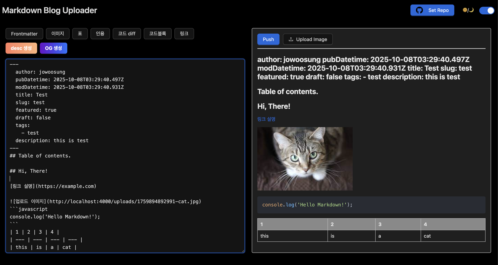

# MarkDown Blog Uploader  
<p align="center">
    
</p>  

## Overview
> This project provides a Markdown upload system for a Next.js-based blog platform.  
Users can preview their posts in real time as they type, ensuring a seamless writing experience.  
To improve usability, the interface simplifies Markdown syntax input through convenient formatting buttons.  
The application is built with React for the frontend interface and includes an internal Express API server for handling image uploads.

## How to Use  
- Since this project requires both frontend and backend services, it is recommended to use Docker Compose for testing.
The structure is as follows:  
```yaml
version: "3.9"

services:
  client:
    build: ./front
    container_name: react-nginx
    ports:
      - "80:80"
    depends_on:
      - server

  server:
    build: ./back
    container_name: express-api
    ports:
      - "4000:4000"
    environment:
      - GITHUB_PAT=your_github_token

```
- modify nginx.conf
```conf
  ...
  location /api/ {
    proxy_pass http://your_server_url/; 
  }
```

- Visit http://localhost:5173 in your browser.
- Configure the following settings as shown below:
    - Repository URL
    - Markdown storage directory
    - Image storage directory (optional)
- When you upload an image, it will be temporarily stored on the Express server and automatically deleted after 30 minutes.  
**When you push your content, the images are also automatically pushed, and their URLs are updated accordingly.**
- The Markdown syntax in this project follows the structure of the template below: [vercel template](https://vercel.com/templates/blog/astro-paper)  
- To modify the frontmatter, you need to update the React source code directly.

## Future Development
- Implement an automatic description generator based on the main content.  
- Add a feature to generate AI-based images from the description and automatically set them as OG images.

## License  
MIT